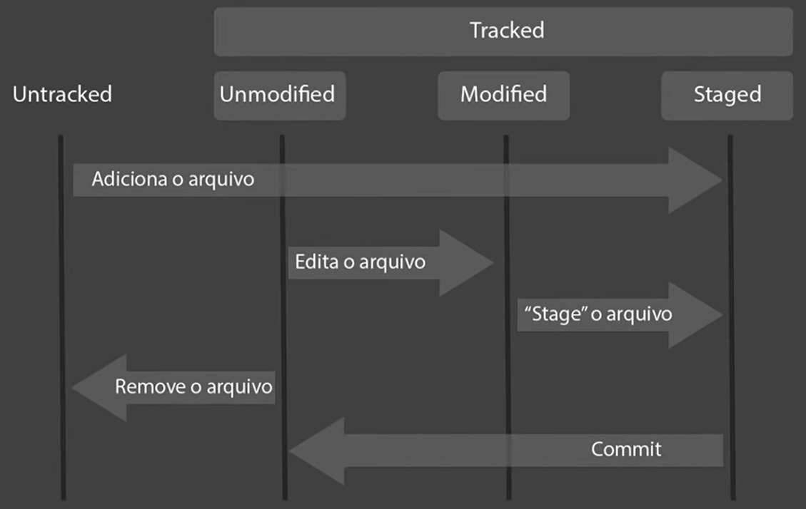
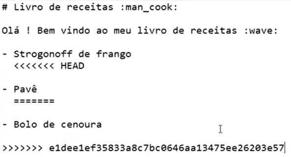

# :open_file_folder: Git e GitHub

- **git init** - Inicia o versionamento git num determinado diretório
- **git add** - Adiciona arquivos git à staging area
- **git commit** - Define as alterações num arquivo como finalizadas
- **git push** - "Empurra" os arquivos da máquina local para o servidor
- **git pull** - "Puxa" os arquivos do servidor para a máquina local
- **git clone** - Clona um repositório

Quando houver um conflito, deve-se fazer um pull e ajustar manualmente os arquivos conflitantes.

Na imagem abaixo, o que está entre `<<<<<<<` e `>>>>>>>` é o conteúdo conflitante. O que está antes do `=======` é a versão mais recente, que você tentou enviar, e o que está depois é a versão que estava no github. No caso do exemplo, pode-se corrigir deixando tanto o Pavê quanto o Bolo de cenoura ou optando por um dos dois.

