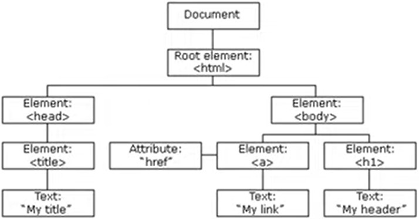
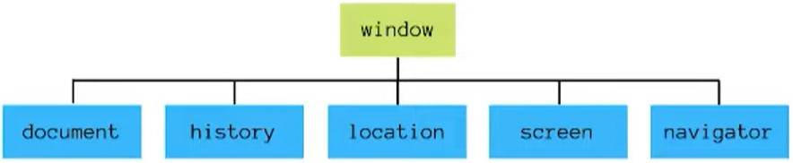

# :deciduous_tree: MANIPULANDO O DOM

O DOM (Document Object Model) é um padrão de como acessar e modificar os elementos HTML de uma página.

O DOM é diferente do BOM (Browser Object Model), que é tudo o que está dentro do objeto window. O DOM é o pai do DOM.

# Métodos

## Selecionando elementos:

    document.getElementByID('titulo');
    // Retorna um elemento único com id "título"

    document.getElementByTagName('li');
    // Retorna um array com todos os elementos li

    document.getElementByClassName('textos');
    // Retorna um array com todos os elementos com classe "textos"

Outro método muito útil é o `.querySelectorAll`, que permite selecionar todos os elementos que possuam um ou mais seletores:

    document.querySelectorAll('li .opcao')
    // Vai retornar um array com todas as li que possuam a classe "opcao".

Importante destacar que ao utilizar o `.getElementsByTagName`, `.getElementsByClassName` e `querySelectorAll` o resultado é sempre um array, mesmo quando houver apenas 1 elemento correspondente.

## Adicionando e deletando elementos:
- `document.createElement(element)`: Cria um novo elemento
- `document.removeChild(element)`: Remove um elemento filho
- `document.appendChild(element)`: Insere um elemento filho
- `document.replaceChild(new, old)`: Substitui um elemento filho

# Trabalhando com estilos

## Element.classList:
O `.classList` é uma propriedade dos elementos que contém uma lista de todas as suas classes. É possível manipulá-la através dos seguintes métodos:

    const meuElemento = document.getElementById("meu-elemento")

    meuElemento.classList.add("novo-estilo");
    // Adiciona a classe "novo-estilo"

    meuElemento.classList.remove("classe");
    // Remove a classe "classe"

    meuElemento.classList.toggle("dark-mode");
    // Adiciona a classe "dark-mode" se o elemento não a possuir e a remove caso a possua.

## Acessando diretamente o CSS:
Para manipular o CSS de um elemento diretamente, utiliza-se a propriedade `style`.

    document.getElementsByTagName("p").style.color = "blue";

# Eventos
Eventos são qualquer tipo de ação que o usuário faça numa página.

- Eventos do mouse: `mouseover`, `mouseout`
- Eventos de clique: `click`, `dbclick`
- Eventos de atualização: `change`, `load`

## Acionando eventos:
Para trabalhar com eventos, utilizamos os **Event listeners**. Eles criam um evento que vai ser acionado no momento em que o usuário realizar determinada ação.

É possível fazer isso no javascript:

    const botao = document.getElementById("meuBotao");

    botao.addEventListener("click", outraFuncao);

Ou através de um atributo HTML:

    <h1 onclick="mudaTexto(this)">Clique aqui!</h1>
    
    