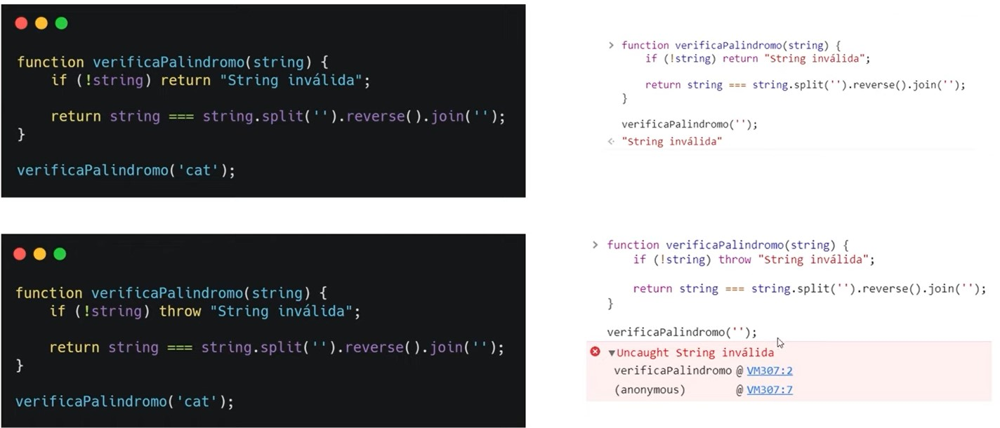
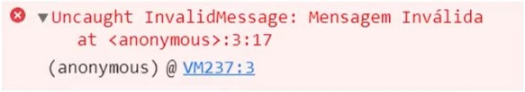

# :bug: TRATAMENTO DE ERROS

# Tipos de erros
- **ECMASCript Error:** Erros que ocorrem em tempo de execução. Composto por mensagem, nome, linha e call stack
- **DOMException:** Erros referentes à estrutura da árvore do DOM.

# Throw
Ao utilizar o `return` para retornar um erro, ele é exibido como uma string no console. Já ao utilizar o `Throw`, o console exibe como um erro, inclusive contabilizando entre os demais erros.

# Try...Catch...Finally
O `try` permite definir um bloco de código a ser testado, procurando por erros enquanto é executado.

Caso ocorra algum erro, utiliza-se o `catch` para executar um outro bloco código.

O `Finally` define uma instrução a ser chamada independente de ter havido erro ou não.

    try {
        // Código a testar
    }
    catch(err) {
        // Código para tratar os erros
    }
    finally {
        // Código que será executado ao fim do teste
    }

# O Objeto Error
O objeto `Error` possui os parâmetros `message`, `fileName` e `lineNumber`, sendo que esses dois últimos são opcionais e não são suportados por todos os navegadores.

    const MeuErro = new Error('Mensagem Inválida');

    throw MeuErro;

### Resultado:

É possível atribuir um nome a um objeto `Error` através da propriedade `name`:

    const MeuErro = new Error('Mensagem Inválida');
    MeuErro.name = 'InvalidMessage';

    throw MeuErro;

### Resultado:

Também é possível indicar o tipo de erro, através dos construtores abaixo:

- `EvalError`
- `InternalError` (Não padrão)
- `RangeError`
- `ReferenceError`
- `SyntaxError`
- `TypeError`
- `URIError`

Mais detalhes: https://developer.mozilla.org/pt-BR/docs/Web/JavaScript/Reference/Global_Objects/Error