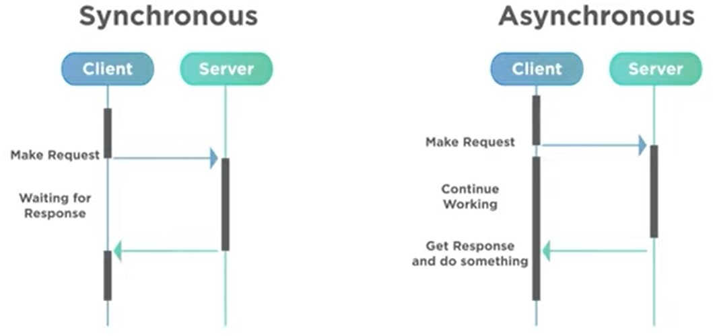

# :twisted_rightwards_arrows: JAVASCRIPT ASSÍNCRONO
 
 Assíncrono é algo que não ocorre ou não se efetiva ao mesmo tempo.
 
 Um exemplo seria o modelo de educação tradicional onde todos os alunos precisam ir à escola para terem a mesma aula no mesmo horário e lugar (síncrono) e o ensino à distância, onde cada aluno pode estudar no local que preferir, o horário que preferir (assíncrono).

O Javascript por padrão roda de maneira síncrona.

# Promises
É um objeto de processamento assíncrono. Inicialmente seu valor é desconhecido e ela então pode ser **resolvida** ou **rejeitada**.

Uma Promise é como um ingresso de cinema: ter o ingresso não garante o resultado. Essa promessa só é resolvida quando você vai ao cinema no dia, horário e local certos. Mas no meio do caminho pode acontecer algum imprevisto e você acabar não conseguir ver o filme, o que equivale à promessa ser rejeitada.

Ela pode ter 3 estados: **Pending**, **Fulfilled** e **Rejected**.

## Estrutura:
    const myPromise = new Promisse((resolve, reject) => {
        window.setTimeout(() => {
            resolve(console.log('Resolvida'));
        }, 2000);
    });

Quando uma promise é resolvida é possível utilizar o resultado dela para fazer outras operações através do `await`. Seguindo com a promise do exemplo anterior:

    await myPromise
        .then((result)) => result + ' passando pelo then')
        .then((result)) => result + ' e agora acabou!')
        .catch((err)) => console.log(err.message);
    
O bloco acima irá, após 2 segundos, retornará o valor: "Resolvida passando pelo then e agora acabou!". Caso dê algum erro, vai rodar o `console.log` definido através do `.catch((err))`.

## Async e Await
Funções assíncronas precisam dessas duas palavras chave.

O `async` aponta que uma determinada função é assíncrona e o `await` indica que o código deve parar de rodar até que uma determinada promise seja resolvida.

    async function resolvePromise() {
        const myPromise = new Promisse((resolve, reject) => {
            window.setTimeout(() => {
                resolve(console.log('Resolvida'));
            }, 2000);
        });

        const resolved = await myPromise
            .then((result)) => result + ' passando pelo then')
            .then((result)) => result + ' e agora acabou!')
            .catch((err)) => console.log(err.message);
        
        return resolved;
    }

Para chamar uma função assíncrona é necessário utilizar o `await`, caso contrário ela irá retornar uma Promise pendente.

É possível utilizar o try...catch com Promises.

# APIs
Uma API (Application Programming Interface) é uma forma de intermediar os resultados do backend com o que é apresentado no frontend. Ela é acessada por meio de URLs.

É muito comum que APIs retornem seus dados no formato .json (JSON: JavaScript Object Notation), portanto precisamos tratar esses dados quando os recebermos.

    {
        "description": "schema POST bank",
        "type": "object",
        "properties": {
            "id": {
                "type": number",
                "minimum": 0
            },
            "code": {
                "type": "string"
            },
            "name": {
                "type": "string"
            }
        }
    }

## Fetch
Método para consumir APIs. Sempre retorna uma Promise, ou seja, é necessário usar await para trabalhar com ele.

    fetch(url, options)
        .then(response => response.json())
        .then(json => console.log(json))
    
    // retorna uma Promise

Através do `fetch` é possível fazer operações no banco de dados (POST, GET, PUT, DELETE, etc).

Exemplo de GET:

    fetch('https://endereco-api.com/', {
        method: 'GET',
        cache: 'no-cache',
    })
        .then(response => response.json())
        .then(json => console.log(json))

Exemplo de POST:

    fetch('https://endereco-api.com/', {
        method: 'POST',
        cache: 'no-cache',
        body: JSON.stringify(data)
    })
        .then(response => response.json())
        .then(json => console.log(json))