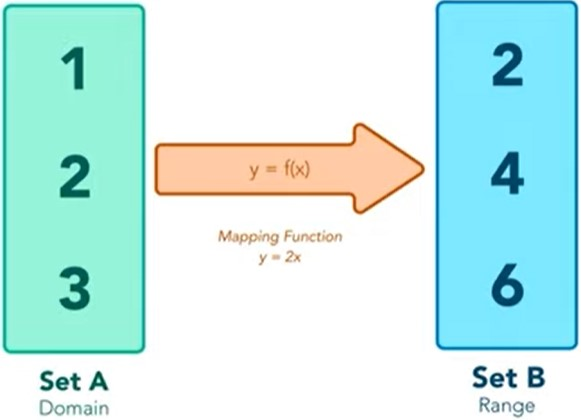

# :mag_right: MAP, FILTER E REDUCE

São três métodos importantes para lidar com Arrays.

# Map
São funções que, através de uma operação, cria um novo array baseado num já existente.

O método array te as seguintes características:

- Cria um novo array;
- Não modifica o array original;
- Realiza as operações em ordem.

## Sintaxe
    array.map(callback, thisArg)

- `callback`: uma função a ser executada em cada elemento. `callback(item, index, array)`
- `thisArg` (opcional): valor de `this` dentro da função de callback.

## Map vs forEach
As diferenças entre o `map` e o `forEach` são o valor de retorno e a necessidade de considerar se será necessário um array auxiliar.

    const array = [1, 2, 3, 4, 5];

    // Usando map:
    array.map((item) => item * 2); // retorna [2, 4, 6, 8, 10]

    // Usando forEach:
    array.forEach((item) => item * 2); // retorna undefined, porque nesse caso é preciso fazer essa operação dentro de uma variável.

# Filter
Esse método permite utilizar uma condição para filtrar os itens de um array e criar um novo array com os itens que passarem pelo filtro.
Assim como o `map`, ele cria um novo array e não modifica o original.

## Sintaxe
    array.filter(callback, thisArg)

- `callback`: uma função a ser executada em cada elemento. `callback(item, index, array)`
- `thisArg` (opcional): valor de `this` dentro da função de callback.

Exemplo:
    
    const frutas = ['maçã fuji', 'maçã verde', 'laranja', 'abacaxi'];

    frutas.filter((fruta) => fruta.includes('maçã')) // fruta equivale a item

    // retorna ['maçã fuji', 'maçã verde']

# Reduce
Diferentemente do `filter` e do `map`, esse método não retorna um novo array. Ele executa uma função em todos os elementos do array e retorna um valor único.

## Sintaxe

    array.reduce(callback, initialValue)

- `callback`: função a ser executada a partir do acumulador.
- `inivialValue` (opcional): valor sobre o qual o retorno final irá atuar.

Exemplo:

    const callbackFn = function(accumulator, currentValue, index, array) {
        // do something
    }

    array.reduce(callbackFn, initialValue)

- `accumulator` (ou `prevValue`): acumulador de todas as chamadas de callbackFn.
- `currentValue`: elemento atual sendo acessado pela função.