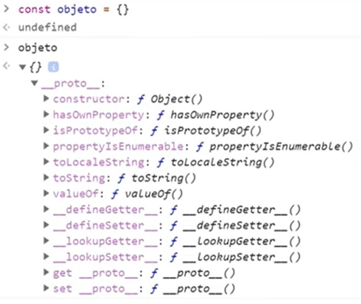

# :o2: ORIENTAÇÃO A OBJETOS

A programação tem dois paradigmas:
- **Imperativo:** foca em como você vai resolver os problemas.Ex.: Programação Orientada a Objetos e Programação Procedural.
- **Declarativo:** foca em o que você vai fazer para os problemas. Ex.: Banco de Dados e Programação Funcional.

Na programação orientada a objetos, os programas são "objetos" que possuem uma série de propriedades.

# Pilares
A programação orientada a objetos possui 4 pilares:

- Herança
- Polimorfismo
- Encapsulamento
- Abstração

## Abstração
Processo mental que consiste em isolar um aspecto determinado de um estado de coisas relativamente complexo, a fim de simplificar a sua avaliação, classificação ou para permitir a comunicação do mesmo.

Exemplo: Carros são objetos complexos. Se abstrairmos, podemos classificálo de forma mais simples como um veículo com rodas. Abstraindo mais ainda, podemos classificá-lo apenas como um veículo.

## Herança
Os objetos filhos herdam propriedades e métodos do objeto pai, mas também possuem suas próprias características.

## Encapsulamento
Consiste no conceito de que cada classe tem propriedades e métodos independentes do restante do código. Com isso, se uma propriedade mudar de valor vai alterar apenas a classe a que pertence e não vai influenciar o restante do código.

## Polimorfismo
Objetos podem herdar a mesma classe pai, mas se comportarem de forma diferente quando invocamos seus métodos.

# Protótipos e Classes

## Protótipos
Os Protótipos em javascript são um esqueleto de todos os objetos. Todos os objetos Javascript irão herdar propriedades e métodos de um prototype e o objeto `Object.prototype` está no topo dessa cadeia.

## Classes
O Javascript não possui classes nativamente, mas o ES6 introduziu uma **Syntatic sugar**, ou seja, uma sintaxe feita para facilitar a escrita.

Apesar da forma de escrever o código ser parecida com outras linguagens, "por debaixo dos panos" estamos utilizando objetos e não classes propriamente ditas.

Todas as classes são objetos e a herança se dá por protótipos.

- `super()`: Método que envia pro construtor da classe pai os parâmetros. No caso acima, a classe `Cat` está enviando a string `'cat'` para o parâmetro `type` da classe `Animal` (classe pai). Também é possível sobrescrever um método da classe pai, como está ocorrendo com `makeSound()`.