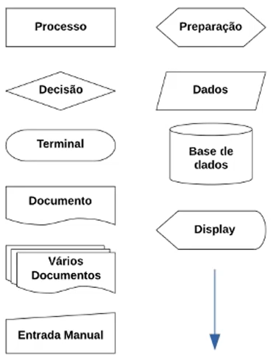
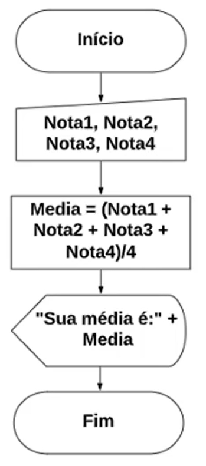

# :page_with_curl: LÓGICA DE PROGRAMAÇÃO

Abstração é a habilidade de concentrar nos aspectos essenciais de um contexto qualquer, ignorando características menos importantes ou acidentais.

# Fluxograma

Uma ferramenta utilizada para representar graficamente o algoritmo, isto é, a sequência lógica e coerente do fluxo de dados.

Exemplo dos blocos de dados (não é um padrão fixo)

Exemplo de fluxograma

- **Variáveis** são espaços na memória do computador destinados a dados que podem ser alterados durante a execução do algoritmo.

- **Constantes** são valores imutáveis que não são alterados durante a vida útil de um programa.

- **Expressões aritméticas** são expressões que utilizam operadores aritméticos e funções aritméticas envolvendo constantes e variáveis. Exemplo: `50 + 50`, `total + 50`

- **Expressões literais** são expressões com constantes e/ou variáveis que tem como resultado valores literais. Exemplo: `nome = “José da Silva”`, `media = (nota1 + nota2) / 2`

- **Expressões relacionais** são expressões compostas por outras expressões ou variáveis numéricas com operadores relacionais. Sempre retornam valores lógicos (verdadeiro/falso). Exemplo: `a ≥ 5`

- **Concatenação** é o termo usado em computação para designar a operação de unir o conteúdo de duas strings.