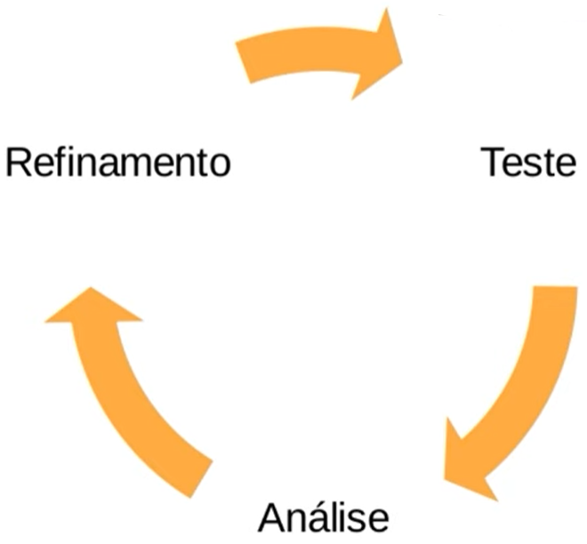
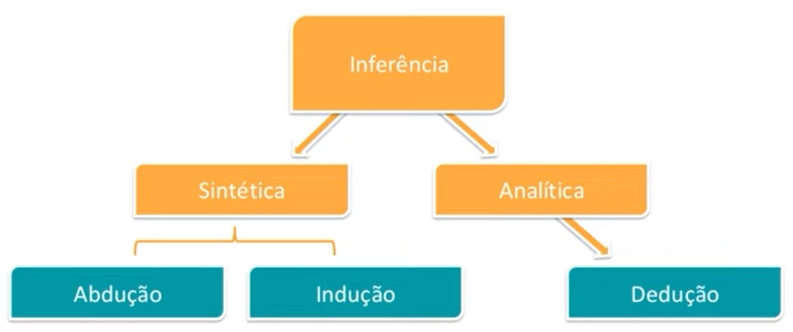
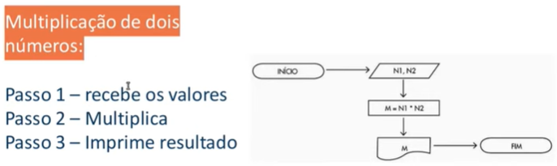

# :thought_balloon: PENSAMENTO COMPUTACIONAL

# Visão Geral

O pensamento computacional é um processo de pensamento que envolve a determinação de um problema e de uma solução em passos computacionais que possam ser executado por um computador.

Baseado em 4 Pilares:

- **Decomposição** - decompor o problema em problemas menores.
- **Reconhecimento de padrões**
- **Abstração** - extrapolar o conceito do problema para uma forma generalista.
- **Design de algoritmos** - consiste de entrada > operação > saída.

O pensamento computacional é um processo contínuo de definir uma solução, testá-la e aperfeiçoá-la.

## Raciocínio Lógico

Forma de pensamento estruturado que permite encontrar a conclusão ou determinar a resolução de um problema.

É classificado em 3 tipos:

- **Indução** - dado um fenômeno observado, pega-se aquele cenário, extrapola-se par ao campo das ideias e determina-se leis e teorias baseadas no que foi observado. Muito utilizado em ciências experimentais.
- **Dedução** - ocorre de forma inversa à indução. Dada uma lei e teoria, realiza-se uma dedução para explicar aquela lei. Muito utilizado em ciências exatas.
- **Abdução** - utiliza a conclusão para chegar à premissa. Ex: A grama está molhada, logo deve ter chovido. Muito utilizado em diagnósticos, processos investigativos.

## Aperfeiçoamento

A partir de uma solução, determinar pontos de melhora e refinamento.

- Encontrar solução eficiente
- Otimizar processos
- Simplificar linhas de códigos
- Funções bem definidas

Esse é um processo contínuo, presente em todas as etapas. Suas principais vantagens são a maior compreensão, mais eficiências, menor tempo e menor armazenamento.

---

# Pilares do Pensamento Computacional

## Decomposição

*“If you can’t solve a problem, then there is an easier problem that you can solve: find it” -* George Polya, professor e matemático

A decomposição é o primeiro passo da resolução de problemas dentro do conceito de pensamento computacional e consiste em quebrar um problema complexo em problemas menores, mais fáceis e gerenciáveis.

Possui 2 etapas:

1. **Análise:** estudar, explorar para quebrar e determinar partes menores.
2. **Síntese:** combinar os elementos recompondo o problema original.

A ordem de execução das tarefas menores pode ser:

- **Sequencial:** há uma dependência entre as tarefas, que são executadas em fila.
- **Paralelo:** as tarefas podem ser executadas concomitantemente.

## Reconhecimento de padrões

Generalizar com o objetivo de obter resolução para problemas diferentes.

- Modelo base
- Estrutura invariante
- Repetição

Realizamos a classificação de objetos a partir de classes e categorias.

Para um computador reconhecer padrões é preciso:

- Representar de atributos
- Aprendizado - conceito associado ao objeto
- Armazenar dados
- Regras de decisão

## Abstração

Abstrair: observar um ou mais elementos, avaliando características e propriedades em separado.

Abstração: processo intelectual de isolamento de um objeto da realidade.

Generalizar: tornar-se geral, mais amplo, extensão.

Generalização: na lógica é a operação intelectual que consiste em reunir numa classe geral, um conjunto de seres ou fenômenos similares.

Como classificar os dados?

- Características (todas as características de um objeto)
- Pontos essenciais (apenas as características que importam para o sistema)
- Generalizar x detalhar

## Algoritmos

Processo de resolução de problemas passo a passo utilizando instruções.

No desenvolvimento de um programa há 3 etapas:

- **Análise:** estudo e definição dos dados de entrada e saída.
- **Algoritmo:** descreve o problema por meio de ferramentas narrativas, fluxograma ou pseudocódigo.
- **Codificação:** o algoritmo é codificado de acordo com a linguagem de programação escolhida.

Características do algoritmo:

- Sequência de passos com objetivo definido.
- A execução de tarefas específica.
- Conjunto de operações que resultam em uma sucessão finita de ações.

Como construir um algoritmo?

- Compreensão do problema
- Definição dos dados de entrada
- Definir processamento
- Definir dados de saída
- Utilizar um método de construção
- Teste e diagnóstico

Métodos para construção de algoritmos:

- **Narrativa:** utiliza a linguagem natural. É fácil de entender, mas pode dar margem para interpretações diferentes.
- **Fluxograma:** utiliza símbolos pré-definidos. É de simples entendimento, mas é necessário ter um conhecimento prévio da estrutura e dos símbolos.
- **Pseudocódigo:** Portugol

Exemplo de um mesmo algoritmo construído com narrativa (à esquerda) e fluxograma (à direita).