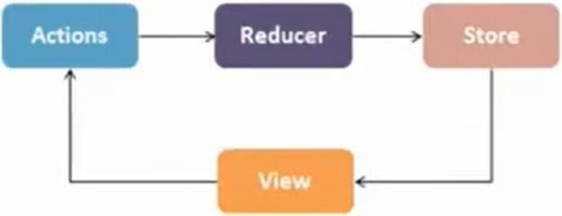

# :atom_symbol: INTRODUÇÃO A REACT COM REDUX
:link: https://github.com/renatobenks/react-redux-talk

# Diferenças entre React e Redux
## React:
É uma biblioteca para construir interfaces. 
- Declarativo
- Baseado em componentes
- Aprendar uma vez, escreva em qualquer lugar

## Redux:
É um state container para aplicações JavaScript. Um state container é um bloco (container) da sua aplicação que armazena um estado de forma centralizada, que pode ser lido por outros blocos da aplicação.
- Previsível
- Centralizado
- Debugável
- Flexível

# Arquitetura Flux

## 3 princípios:
- Uma única fonte de verdade
- Estado disponível apenas para leitura
- Mudanças no estado são feitas apenas por funções puras

## Aspectos (API):
- **reducer**: store.getState()
<!-- -->
    function counterReducer(state = {value: 0}, action) {
        switch (action.type) {
            case 'counter/incremented':
                return { value: state.value + 1 }
            case 'counter/decremented':
                return { value: state.value - 1 }
            default:
                return state
        }
    }

- **store**: createStore()
<!-- -->
    const store = createStore(counterReducer);

- **actions**: store.dispatch()
<!-- -->
    store.dispatch({ type: 'counter/incremented' }) // {value: 1}
    store.dispatch({ type: 'counter/incremented' }) // {value: 2}
    store.dispatch({ type: 'counter/decremented' }) // {value: 1}

- **view**: connect (react-redux)
<!-- -->
    function TodoList({todoList, dispatch}) {
        return(
            // renders something and dispatch an action
        )
    }

<!-- -->

    function mapStateToProps(state) {
        return { todoList: state.todos.allIds };
    }

    export default connect(mapStateToProps)(TodoList);

