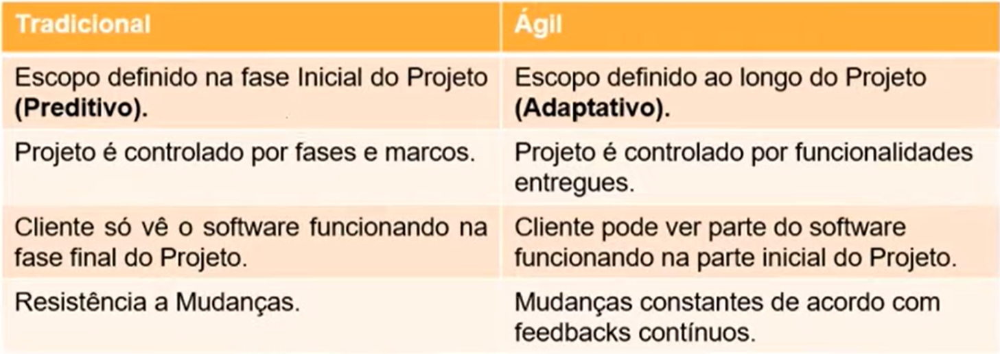

# :curly_loop: Projetos Agéis com SCRUM

# Conceitos Básicos

SCRUM é um dos frameworks de gerenciamento de projetos ágeis. Projetos usando equipes pequenas e multidisciplinares produzem os melhores resultados.

Em projetos tradicionais (Waterfall) você corre o risco de descobrir que estava errado depois de meses. Com o SCRUM, você descobre que estava errado em no máximo 30 dias.

Um projeto ágil não necessariamente é um projeto mais rápido. “Ser ágil é errar rápido e corrigir rápido”.

## Pilares:

- **Transparência** - Conversar mais e escrever menos; demonstrar o software constantemente aos usuários e obter feedbacks constantes.
- **Adaptação** - Requisitos mudam ao longo do tempo; aprender progressivamente com o uso do software.
- **Inspeção** - Daily meetings

## Razões para adotar o SCRUM:

- Desenvolvido e entregue em partes menores (2 a 4 semanas) com constante feedback dos usuários;
- Melhor gerenciamento de riscos (redução de incertezas);
- Comprometimento, motivação e transparência da equipe (daily meeting);
- Maior valor para o negócio (priorização do backlog);
- Usuários envolvidos durante todo o ciclo;
- Aplicação das lições aprendidas (melhoria contínua).

## Características do time SCRUM:

- Equipes capazes de se auto-organizarem;
- As tarefas são do time e todos são responsáveis;
- Forte comprometimento com os resultados.

---

# Papéis e responsabilidades

## Product Owner (PO):

- Representante da área de negócios;
- É uma pessoa, não um comitê;
- Define as funcionalidades do software (Product Backlog);
- Prioriza as funcionalidades de acordo com o valor do negócio;
- Garante que o time de desenvolvimento entenda os itens do Backlog no nível necessário.
- Não é chefe do time.

## Scrum Master (SM):

- Garante o uso correto do SCRUM;
- Não é um Gerente de Projetos, não é ele quem delega as atividades para o time;
- Age como facilitador;
- Auxilia o Product Owner no planejamento e estimativas do Backlog;
- Auxilia a equipe a remover impedimentos;
- Treina o time em auto gerenciamento e interdisciplinaridade.
- Não é chefe do time.

## Time de Desenvolvimento (DEV):

- Possui habilidades suficientes para desenvolver, testar, criar e desenhar, ou seja, tudo que for necessário para entregar o software funcionando.

---

# Cerimônias do SCRUM

- **Time Box** - o tempo máximo para fazer uma cerimônia ou Sprint.
- **Sprint** - principal evento do SCRUM. Duração de no máximo 30 dias.

## Planejamento da Sprint:

Feito no primeiro dia da Sprint.

Time Box: 8h (Sprint 30 dias). Nas primeiras 4 horas discute-se o que fazer e nas outras 4h o time de desenvolvimento discute como fazer. O PO não deve participar da segunda fase.

Nesse planejamento pode-se utilizar várias técnicas como o Planning Poker.

## Reuniões Diárias (Daily Meeting):

Time Box: 15 minutos.

Feitas diariamente no mesmo horário com todos participando de pé. Também conhecida como stand up meeting. A presença do PO e do SM não é obrigatória.

O time de desenvolvimento responde 3 perguntas: O que fez no dia anterior, o que está programado para o dia e se há impedimentos.

## Revisão da Sprint (Review):

No último dia da Sprint ocorre uma revisão onde o time de desenvolvimento apresenta para o PO o trabalho feito. SM e Stakeholders podem participar.

Time Box: 4h (Sprint de 30 dias).

## Retrospectiva da Sprint:

No último dia da Sprint ocorre uma reunião com a equipe de desenvolvimento e SM (PO pode participar ou não) para discutir o que foi bom e ruim na Sprint. Deve haver transparência.

Time Box: 3h (Sprint de 30 dias)

---

# Papéis e responsabilidades do PO

## Refining:

Cerimônia antes do Planning onde o PO deve apresentar as histórias que deverão ser apresentadas no planning. O objetivo é saber previamente o que será desenvolvido. Todas as dúvidas devem ser tiradas nessa fase.

Nessa cerimônia é permitida a presença dos stakeholders.

## Release Planning:

Liberação ou lançamento de software. Não é obrigatório que haja um release ao final de todas as sprints, mas é recomendado.

## Analisar escopo e definir prioridades:

A imagem abaixo exemplifica o mesmo projeto feito em sprints, mas no primeiro caso as 3 primeiras sprints não apresentavam nenhum valor ao cliente, enquanto no caso 2 cada sprint resultou em um meio de locomoção útil até chegar ao objetivo final.

## Product Backlog:

Composto por Épicos e Estórias.

- **Épico** - Incremento sem muito detalhamento, ajuda a direcionar os caminhos a serem seguidos.
- **Estória** - Detalhamento dos épicos. Um épico normalmente se divide em várias estórias, onde ficam descritos o que deve acontecer e suas regras de **negócio**.
- **Tarefa:** Conjunto de atividades que o time de desenvolvimento deve desempenhar para entregar a estória.

Escrevendo uma estória:

- Nome da estória
- Descrição (Eu, como, quero, quando)
- Regras de negócio (separar regras de front-end das de back-end)
- Tela (Link ou imagem das telas a serem desenvolvidas)
- KPI (Quais objetivos/valor a estória precisa atingir)
- Tagueamento (Como a estória será “tagueada” para poder mensurar os KPIs)
- Critérios de aceite (Qual o passo a passo de todos os caminhos felizes possíveis a estória deve cumprir para que seja considerada aceita)

## Gestão de Riscos:

- Positivos - Muito ignorado nos projetos, porém um dos fatores de maiores ganhos no desenvolvimento de sistemas.
- Negativos: Itens que podem afetar o prazo, custo ou escopo de um projeto de maneira que pode acabar inviabilizando-o.

## Transformação Digital:

Processo no qual as empresas fazem uso da tecnologia para melhorar o desempenho, aumentar o alcance e garantir resultados melhores.

---

# Conceitos

## Épicos, Estórias e Tarefas:

No projeto de construir uma bicicleta, temos:

- **Épicos:** Objetivo macro que deve ser atingido e para isso precisa ser quebrado em objetivos menores: Quadro, Garfo, Rodas, Celim, Sistema de freio, Sistema de tração. O Épico Garfo consiste nas estórias Guidão e Amortecedores, assim como o pedal é uma estória do sistema de tração.
- **Tarefas:** Para realização da estória Garfo, é necessário executar as tarefas montar o guidão, montar o garfo, montar o garfo no quadro etc.

Épicos são conjuntos de Estórias, que por sua vez são conjuntos de Tarefas.